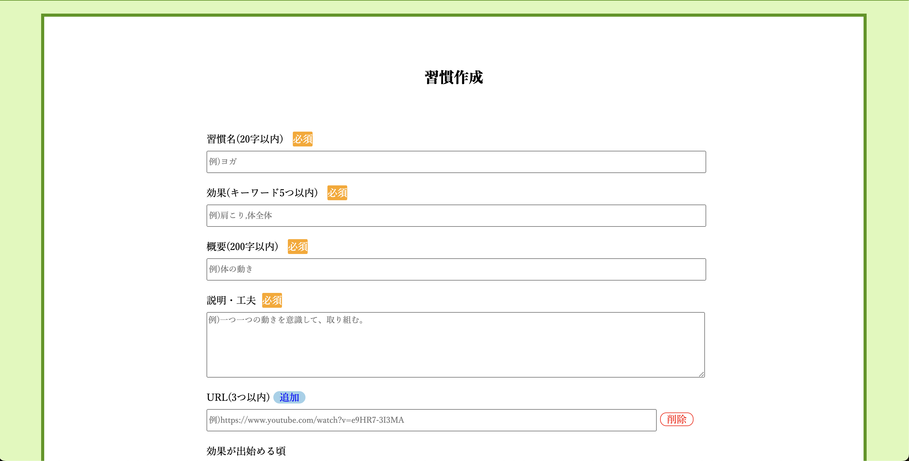
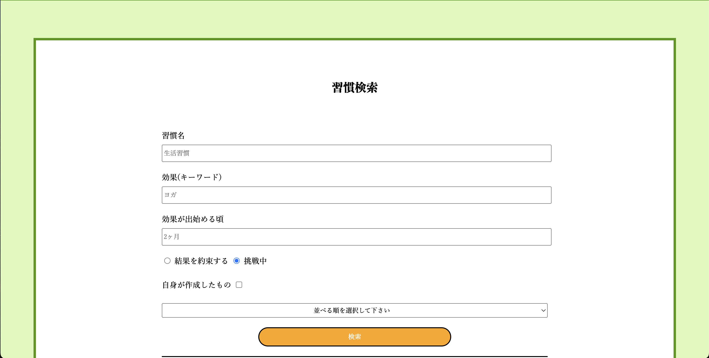
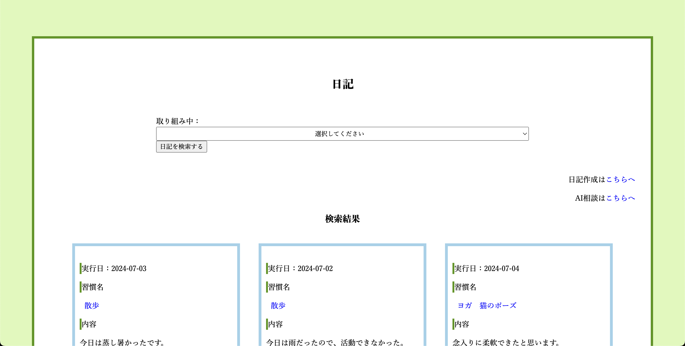
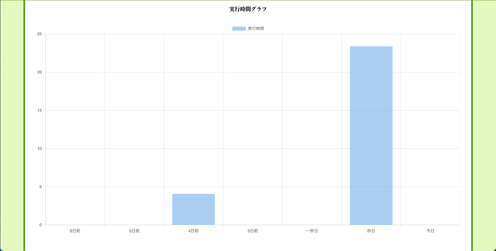
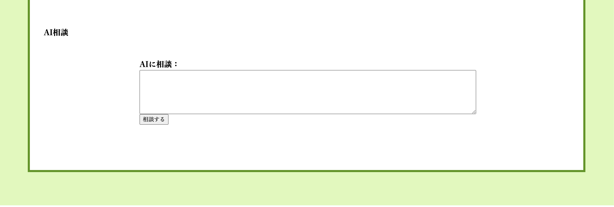
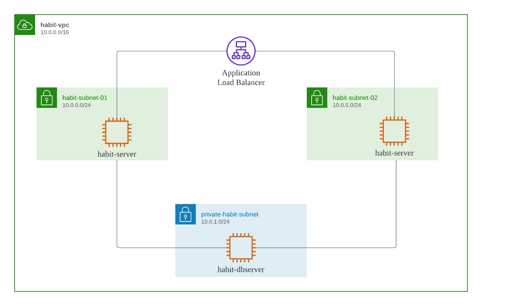
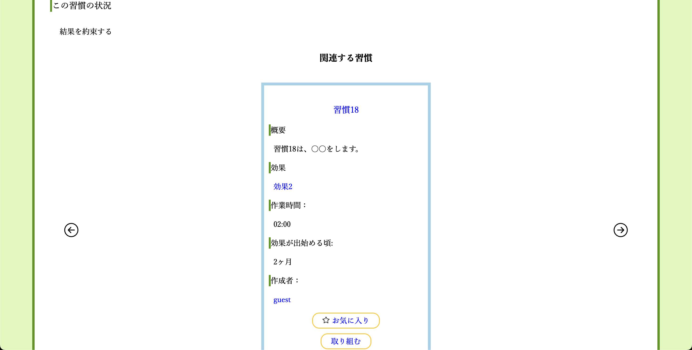

# 習慣SNS
このサイトは、人生を変えた習慣を共有し、自分自分の生活に取り入れる手助けをします。

ユーザー自身が習慣を登録して、他のユーザーに伝えることがこのサイトの特徴です。

人の行動は45%ほどが習慣的な行動だと言われています。

身につけている習慣が良ければ、良い方向に動き、良くないものであれば、悪い方向に動きそうです。

例えば、睡眠では、睡眠不足が続いていると、日中のパフォーマンスが落ちて、信頼を落としてしまうこともあります。

朝食を抜くと、集中力が出ないことやイライラすることがあります。

そこで、習慣を見直して、良い習慣を取り入れ、人生を少しでも生きやすくしていきましょう。

- 参考文献： [みんチャレ | 小さな毎日の習慣で人生が大きく変わる！おすすめの習慣と継続のコツ](https://minchalle.com/blog/recommended-daily-habits#1-145)

## 作成した理由

私は、大学卒業後、3年間ほどITの勉強をしてきました。

ITパスポートや基本情報技術者試験に合格しました。

しかし、私はIT業界に就職しようと思ったのですが、未経験な人はIT業界に入りづらいことや、IT業界の今後についての記事を読み、無理かもしれないと思いました。

手に職をつけようと、職業訓練で電気工事関連の資格を取得し、電気工事の仕事に1年半ほど就きました。

IT業界のことが忘れられずに、IT業界に就きたい、大学で学んだITの知識を活用したいと決意して、ポテパンキャンプを受講しました。

これまでの自分は、人に頼ることが少なく、困っていることを相談していなかった気がします。しかし、職業訓練に行ったり、ポテパンキャンプを受講して、人に頼ることも大事なのだと知りました。
そのため、人生を好転させるには、考えや行動を少しずつ修正していけば良いと思い、このサービスを制作しました。

## 使い方

- 習慣作成

ユーザーが習慣を作成します。

作成する習慣は、挑戦中か結果済を選ぶことができます。

挑戦中の習慣は、気軽に作成して、挑戦できます。

結果済の習慣は、良い習慣を他のユーザーに伝えられます。

- 習慣検索

この機能は、ユーザーが作成したものを元に、検索結果を表示できます。

- 日記

習慣の中から取り組むものを選び、日々の生活記録を記録できます。

記録していき、良かったことや悪かったことを振り返ります。

- 実行グラフ

「取り組み中」の中から習慣を選ぶと、直近1週間の実行時間を表示します。

取り組み具合をグラフで可視化することで、どれだけ意欲的・継続的に動いているかを知れます。

- AI相談

不安な考えや、習慣に疑問や質問が浮かんだときに、AIに気軽に相談できます。

## E-R図

## 使用環境

- HTML
- CSS
- JavaScript
- Ruby
- Ruby on Rails
- PostgreSQL
- RSpec
- CircleCI
- Docker
- AWS

## システム構成

## こだわりポイント

技術的にこだわった所を紹介します。

- 習慣作成・更新ページ

フォームオブジェクトを利用しました。

habitテーブルにあるカラムだけでなく、他のテーブルのカラムも利用することから、フォームをカスタマイズしました。

- 関連する習慣

これは、ユーザーが直近で訪問した習慣を表示します。

ユーザーがある習慣に訪れた時に、その習慣idをキャッシュに保存しておきます。

次に別の習慣を表示したときに、その習慣は以前保存した習慣idと紐付けます。

- AI相談

OpenAIを使えるように、APIを制作しました。

APIは、ユーザーが相談した文章をOpenAIに送り、受け取ったものをjsonで表示します。

JQueryのAjax機能がそのAPIを利用して、OpenAIの回答を表示します。

