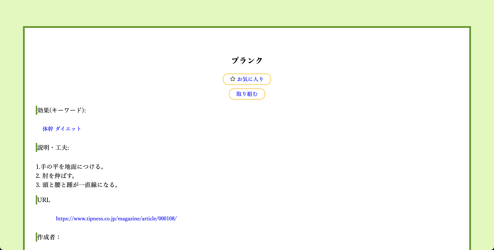
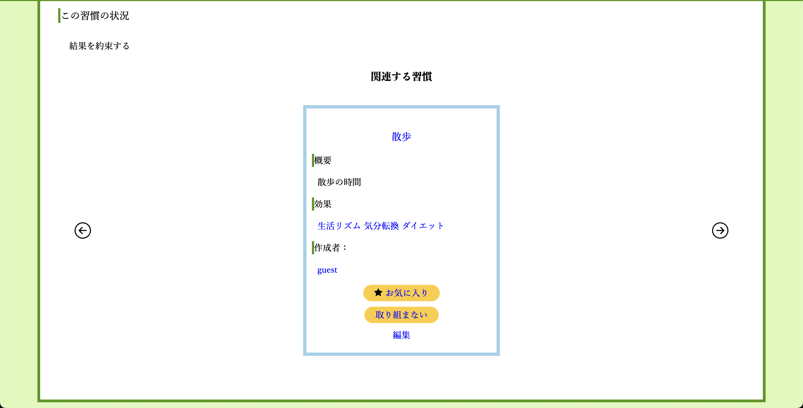

# 習慣SNS

このサイトは、人生を好転させた習慣を共有し、自分自分の生活に取り入れる手助けをします。

ユーザー自身が習慣を登録して、他のユーザーに伝えます。

ところで、習慣は、人の行動の何割を占めているかご存知でしょうか？

> "人の45%の行動が習慣だと言われております。"

身につけている習慣が良ければ、良い方向に動き、良くないものであれば、悪い方向に動きます。

例えば、睡眠では、睡眠不足が続いていると、日中のパフォーマンスが落ちて、信頼を落としてしまうこともあります。

また、朝食を抜くと、集中力が出ないことやイライラすることがあります。

そこで、習慣を見直して、良い習慣を取り入れ、人生を少しでも生きやすくしていきましょう。

- 参考文献： [みんチャレ | 小さな毎日の習慣で人生が大きく変わる！おすすめの習慣と継続のコツ](https://minchalle.com/blog/recommended-daily-habits#1-145)

## 作成した理由

良い習慣を共有すれば、人生を生きやすくできるのではないのかと思い、私はこのアプリを作成しました。

習慣を共有するサイトを作成した理由が、2つあります。

私自身が習慣を変えたことです。

私は、今まで人に相談したり、頼ることが少なかったのですが、
ポテパンキャンプを受講したことで、人に頼ることの大切さを知りました。

考え方を少し変えてみることで、これまでと違う行動ができます。

次に、SNSの特徴を活かすことです。

SNSは、ユーザーが投稿を共有して、素早く情報を伝えます。

それにより、行っていた悪い習慣を良い習慣に修正して、人生をより豊かにします。

良い習慣を素早く取り入れることで、「あの時に知りたかった」などの後悔を少なくすることができます。

## 使い方

- 習慣作成

ユーザーが習慣を作成します。

作成する習慣は、「挑戦する」か「結果を約束する」かを選ぶことができます。

挑戦中の習慣は、気軽に作成して、挑戦できます。

結果済の習慣は、良い習慣を他のユーザーに伝えられます。

- 習慣検索

この機能は、ユーザーが作成したものを元に、検索結果を表示できます。

- 習慣詳細ページ

「お気に入り」と「取り組む」ボタンが習慣詳細ページにあります。

表示している習慣が「挑戦中」の状態であるならば、ユーザーが自由にコメントできます。

作成者に助言できます。

表示している習慣が「結果を約束する」の状態であるとき、関連する習慣が表示されます。

- 日記

習慣の中から取り組むものを選び、日々の生活記録を記録できます。

記録していき、良かったことや悪かったことを振り返ります。

- 実行グラフ

「取り組み中」の中から習慣を選ぶと、直近1週間の実行時間を表示します。

取り組み具合をグラフで可視化することで、どれだけ意欲的・継続的に動いているかを知れます。

- AI相談

不安な考えや、習慣に疑問や質問が浮かんだときに、AIに気軽に相談できます。

- アカウント

「日記」、「習慣」、「follower」、「following」のボタンがあります。

それぞれに合った内容が表示されます。

「習慣」は、ユーザーがお気に入りに入れたものです。

## E-R図

## 使用環境

- HTML
- CSS
- JavaScript
- Ruby
- Ruby on Rails
- PostgreSQL
- RSpec
- CircleCI
- Docker
- AWS EC2
- AWS VPC
- AWS　Route53

## システム構成

## こだわりポイント

技術的にこだわった所を紹介します。

- 習慣作成・更新ページ

フォームオブジェクトを利用しました。

habitテーブルにあるカラムだけでなく、他のテーブルのカラムも利用することから、フォームをカスタマイズしました。

- 関連する習慣

これは、ユーザーが直近で訪問した習慣を表示します。

ユーザーがある習慣に訪れた時に、その習慣idをキャッシュに保存しておきます。

次に別の習慣を表示したときに、その習慣は以前保存した習慣idと紐付けます。

- AI相談

OpenAIを使えるように、APIを制作しました。

APIは、ユーザーが相談した文章をOpenAIに送り、受け取ったものをjsonで表示します。

JQueryのAjax機能がそのAPIを利用して、OpenAIの回答を表示します。

## 今後の課題

私は、Reactを学び始めたところなので、ReactとRailsが連携するアプリを作成していきたいです。

また、セキュリティ関係やAWSを勉強し、情報漏洩がないセキュアなアプリケーションを作りたいです。
